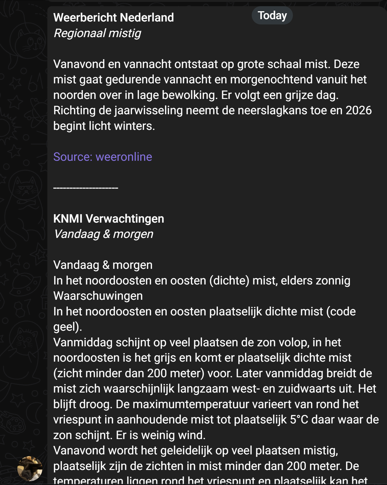

# PushNotification



PushNotification is a small Python automation project that collects daily weather updates from Dutch sources, formats them into a single Telegram message, and sends that digest on a schedule through GitHub Actions.

The codebase is intentionally structured as a pipeline rather than a one-off script, so sources, formatting, and delivery can evolve independently.

## What It Does

- Fetches weather summaries from multiple Dutch sources
- Normalizes each result into a shared forecast model
- Formats the output as Telegram-friendly HTML
- Sends one combined message through the Telegram Bot API
- Runs automatically on GitHub Actions every day

## Current Sources

- `weeronline`
- `knmi`

Both are configured in [configs/sources.yaml](/d:/Repositories/PushNotification/configs/sources.yaml).

## Tech Stack

- Python 3.13+
- [`uv`](https://github.com/astral-sh/uv) for dependency management
- Playwright for browser automation and scraping
- Requests for HTTP calls
- GitHub Actions for scheduling and execution
- Telegram Bot API for delivery

## Project Layout

```text
PushNotification/
  configs/
    sources.yaml
  src/
    push_notification/
      config.py
      http.py
      main.py
      models.py
      formatters/
        default.py
      notifiers/
        telegram.py
      sources/
        __init__.py
        base.py
        knmi.py
        weeronline.py
  .github/
    workflows/
      dail_run.yaml
  pyproject.toml
  uv.lock
  README.md
```

## How The Pipeline Works

```text
Configured source
  -> source fetcher
  -> shared forecast model
  -> Telegram formatter
  -> Telegram notifier
```

The entry point is [src/push_notification/main.py](/d:/Repositories/PushNotification/src/push_notification/main.py). It loads enabled sources from config, fetches each report, formats the results, and sends a single combined Telegram message.

## Configuration

Source configuration lives in [configs/sources.yaml](/d:/Repositories/PushNotification/configs/sources.yaml):

```yaml
sources:
  - name: weeronline
    enabled: true
    url: https://www.weeronline.nl/weerbericht-nederland

  - name: knmi
    enabled: true
    url: https://www.knmi.nl/nederland-nu/weer/verwachtingen
```

Each enabled source must exist in `SOURCE_REGISTRY` inside [src/push_notification/sources/__init__.py](/d:/Repositories/PushNotification/src/push_notification/sources/__init__.py).

## Local Setup

```bash
uv venv
uv sync
```

Set the required environment variables before running locally:

```bash
export TG_BOT_TOKEN=123456:ABC...
export TG_CHAT_ID=-1001234567890
```

Then run:

```bash
uv run python -m push_notification.main
```

## Required Secrets

GitHub Actions expects these repository secrets:

| Secret | Purpose |
| --- | --- |
| `TG_BOT_TOKEN` | Telegram Bot API token |
| `TG_CHAT_ID` | Target chat or group ID |

Store raw values only. Do not wrap them in quotes.

## GitHub Actions Schedule

The workflow lives at [.github/workflows/dail_run.yaml](/d:/Repositories/PushNotification/.github/workflows/dail_run.yaml).

GitHub Actions cron runs in UTC, so the workflow uses two schedule entries and a runtime time-zone gate for `Europe/Amsterdam`:

```yaml
schedule:
  - cron: "0 19 * * *" # 21:00 CEST
  - cron: "0 20 * * *" # 21:00 CET
```

At runtime, the job checks whether the local Amsterdam hour is `21`. That keeps the daily run aligned with local time across daylight saving changes.

## Playwright Note

The CI workflow installs Chromium with Playwright before running the pipeline:

```bash
uv run playwright install --with-deps chromium
```

This is required for the scraper sources used in the project.

## Extending The Project

- Add a new source under `src/push_notification/sources/`
- Register it in `SOURCE_REGISTRY`
- Add its config entry to `configs/sources.yaml`
- Adjust formatting in `src/push_notification/formatters/default.py` if needed
- Add more notifiers later if delivery needs to expand beyond Telegram

## Known Limitations

- Source website markup can change and break scrapers
- Telegram message length is limited
- The current notifier targets Telegram only

## License

MIT. See [LICENSE](/d:/Repositories/PushNotification/LICENSE).
